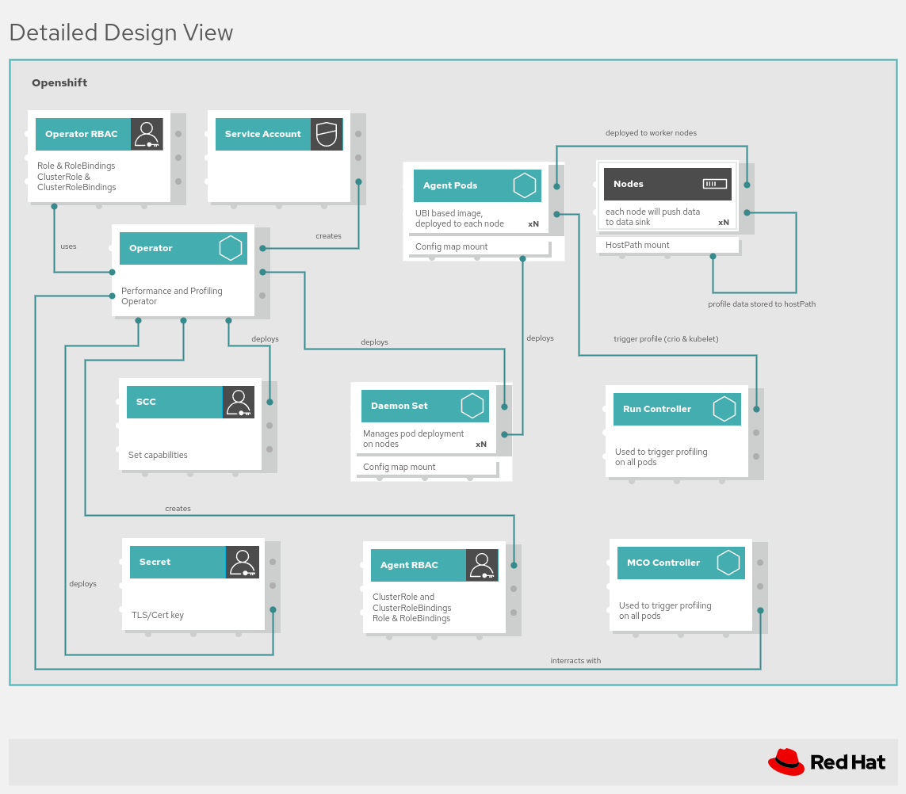

# NodeObservability Operator

**Note**: This Operator is in the early stages of implementation and keeps changing.

The NodeObservability Operator allows you to deploy and manage [NodeObservability Agent](https://github.com/openshift/node-observability-agent) on the worker nodes. The NodeObservability agent is deployed through DaemonSets on the selected nodes.     
Afterward, the profiling requests can be created to trigger different types of profiling. The profiling data will be accessible in the root filesystem of the NodeObservability Agent.

- [Deploying the  NodeObservability Operator](#deploying-the-nodeobservability-operator)
    - [Installing the NodeObservability Operator](#installing-the-nodeobservability-operator)
    - [Installing the NodeObservability Operator using a custom index image on the OperatorHub](#installing-the-nodeobservability-operator-using-a-custom-index-image-on-the-operatorhub)
- [Verifying the installation of NodeObservability Operator](#verifying-the-installation-of-nodeobservability-operator)
- [Creating the NodeObservability CR](#creating-the-nodeobservability-cr)

## Architecture Overview



### Description

The node-observability-operator once installed will create a daemonset on all or only labeled nodes, once 
the cluster-admin creates and deploys a CRD for nodeobservability. After ensuring all agent pods are running on the desired nodes
the cluster-admin can then create a node-observability-run CRD, this will then call the API end points of all agents and trigger
either a profiling or scripting execution, the profiling data/ scripting artifacts will be stored in the agent container using hostPath for later retrieval


## Deploying the `NodeObservability` Operator

NodeObservability Operator can be deployed using one of the following procedures.

### Installing the `NodeObservability` Operator

You can install the NodeObservability Operator by building and pushing the Operator image into a registry.

1. To build and push the Operator image into a registry, run the following commands:
   ```sh
   # set the envar CONTAINER_ENGINE to the preffered container manager tool (default is podman)
   export IMG=${REGISTRY}/${REPOSITORY}/node-observability-operator:${VERSION}
   make container-build container-push
   ```
2. To deploy the NodeObservability Operator, run the following command:
    ```
    make deploy
    ```
   To specify the custom image for the NodeObservability Agent, patch the deployment of the operator with the following command:
    ```sh
    oc set env deployment/node-observability-operator --containers=manager RELATED_IMAGE_AGENT=${MY_IMAGE_AGENT} -n node-observability-operator
    ```
3. The previous step deploys the conversion webhook, which requires the TLS verification on the webhook server's side. The
   manifests deployed through the `make deploy` command do not contain a valid certificate and key. You must provision a valid certificate and key through other tools.     
   If you run on OpenShift, you can use a convenience script, `hack/add-serving-cert.sh` to enable [the service serving certificate feature](https://docs.openshift.com/container-platform/4.11/security/certificates/service-serving-certificate.html).    
   Run the `hack/add-serving-cert.sh` script with the following inputs:
   ```sh
   hack/add-serving-cert.sh --crd "nodeobservabilities.nodeobservability.olm.openshift.io nodeobservabilitymachineconfigs.nodeobservability.olm.openshift.io" \
   --service node-observability-operator-webhook-service --secret webhook-server-cert --namespace node-observability-operator
   ```
   *Note*: you may need to wait for the retry of the volume mount in the operator's POD

### Installing the `NodeObservability` Operator using a custom index image on the OperatorHub
**Note**: It is recommended to use `podman` as a container engine.

NodeObservability Operator can be installed by building and pushing the custom OLM bundle index image.

1. Build and push the Operator image to the registry:
    ```sh
    export IMG=${REGISTRY}/${REPOSITORY}/node-observability-operator:${VERSION}
    make container-build container-push
    ```

2. Build and push the bundle image to the registry:
    ```sh
    export BUNDLE_IMG=${REGISTRY}/${REPOSITORY}/node-observability-operator-bundle:${VERSION}
    make bundle-build bundle-push
    ```

3. Build and push the index image to the registry:
   ```sh
   export INDEX_IMG=${REGISTRY}/${REPOSITORY}/node-observability-operator-bundle-index:${VERSION}
   make index-image-build index-image-push
   ```

4. (Optional) If the image is private, then link the registry secret to the pod of the `node-observability-operator` created in the `openshift-marketplace` namespace:

    a. Create a secret with authentication details of your image registry (you have to be logged into the registry):
    ```sh
    oc -n openshift-marketplace create secret generic nodeobs-olm-secret --type=kubernetes.io/dockercfg --from-file=.dockercfg=${XDG_RUNTIME_DIR}/containers/auth.json
    ```
    b. Link the secret to the `default` service account:
    ```sh
    oc -n openshift-marketplace secrets link default nodeobs-olm-secret --for=pull
    ````

5. Create the `CatalogSource` object:
   ```
   cat <<EOF | oc apply -f -
   apiVersion: operators.coreos.com/v1alpha1
   kind: CatalogSource
   metadata:
     name: node-observability-operator
     namespace: openshift-marketplace
   spec:
     sourceType: grpc
     image: ${INDEX_IMG}
   EOF
   ```


6. Install the operator from the command line client or from the webUI:

**From the CLI**
1. Create the Operator namespace:
    ```sh
    oc create namespace node-observability-operator
    ```

2. Create the `OperatorGroup` object to scope the Operator to `node-observability-operator` namespace:
    ```
    cat <<EOF | oc apply -f -
    apiVersion: operators.coreos.com/v1
    kind: OperatorGroup
    metadata:
      name: node-observability-operator
      namespace: node-observability-operator
    EOF
    ```

3. Create the `Subscription` object:
    ```
    cat <<EOF | oc apply -f -
    apiVersion: operators.coreos.com/v1alpha1
    kind: Subscription
    metadata:
      name: node-observability-operator
      namespace: node-observability-operator
    spec:
      channel: alpha
      name: node-observability-operator
      source: node-observability-operator
      sourceNamespace: openshift-marketplace
    EOF
    ```
    If you want to specify the agent image of your choice, use the following subscription:
    ```
    cat <<EOF | oc apply -f -
    apiVersion: operators.coreos.com/v1alpha1
    kind: Subscription
    metadata:
      name: node-observability-operator
      namespace: node-observability-operator
    spec:
      channel: alpha
      name: node-observability-operator
      source: node-observability-operator
      sourceNamespace: openshift-marketplace
      env:
      config:
        env:
          - name: RELATED_IMAGE_AGENT
            value: ${MY_IMAGE_AGENT}
    EOF
    ```

**From the webUI**
1. Log in to the OpenShift Container Platform web console.
2. Navigate to **Operators → OperatorHub**.
3. Type **Node Observability Operator** into the filter box and select it.
4. Click **Install**.
5. On the Install Operator page, select a specific namespace on the cluster. Select **node-observability-operator** from the drop-down menu.
6. Once finished, the Node Observability Operator will be listed in the Installed Operators section of the web console.

## Verifying the installation of `NodeObservability` Operator

Run the following commands to verify that the Node Observability Operator has been installed:
```sh
oc -n node-observability-operator get subscription -o yaml
oc -n node-observability-operator get installplan -o yaml
oc -n node-observability-operator get deployment/node-observability-operator
```

## Creating the `NodeObservability` CR

Run the following command to create an instance of `NodeObservability`:
```sh
oc apply -f config/samples/nodeobservability_v1alpha2_nodeobservability-all.yaml
```
